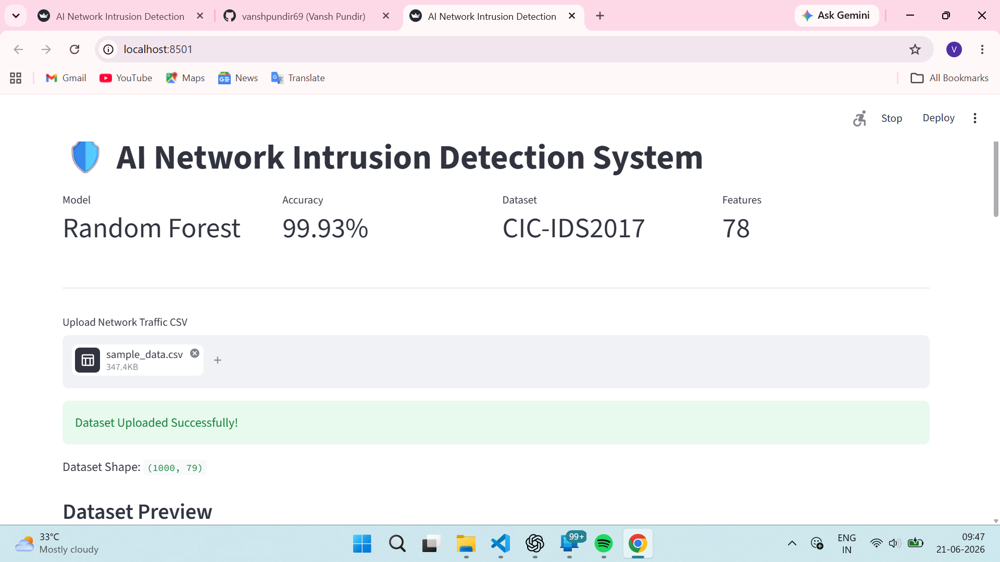
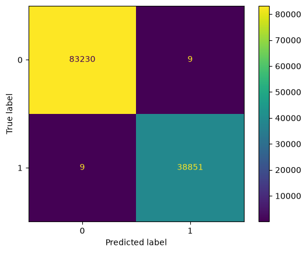

# 🛡️ AI-Powered Network Intrusion Detection System

## Project Overview

This project presents an AI-powered Network Intrusion Detection System developed using Python, Scikit-learn, Streamlit, and the CIC-IDS2017 dataset.

The system analyzes network traffic records and classifies them as either benign or malicious using a Random Forest machine learning model. The project includes data preprocessing, feature engineering, model training, visualization, and an interactive dashboard for real-time prediction and analysis.

---

## Key Features

* Data preprocessing and cleaning of CIC-IDS2017 traffic data
* Machine learning-based intrusion detection
* Random Forest classification model
* 99.93% detection accuracy
* Interactive Streamlit dashboard
* CSV upload functionality
* Prediction reporting
* Attack vs Benign visualization
* Feature importance analysis
* Export predictions as CSV

---

## Tech Stack

### Programming Languages

* Python
* SQL

### Libraries

* Pandas
* NumPy
* Scikit-learn
* Matplotlib
* Seaborn
* Plotly
* Joblib

### Frameworks & Tools

* Streamlit
* Git
* GitHub
* VS Code

---

## Dataset

Dataset Used:

**CIC-IDS2017**

The dataset contains realistic network traffic and modern attack scenarios including:

* DoS Hulk
* DoS GoldenEye
* DoS Slowloris
* DoS Slowhttptest
* Heartbleed

---

## Model Performance

| Metric          | Value         |
| --------------- | ------------- |
| Accuracy        | 99.93%        |
| Dataset Records | 610,492+      |
| Features        | 78            |
| Model           | Random Forest |

---

## Dashboard Screenshots

### Dashboard Overview



### Detection Results


## System Architecture


## Model Evaluation

### Confusion Matrix



---

## Project Structure

```text
AI-Network-Intrusion-Detection
│
├── dashboard/
├── src/
├── saved_models/
├── screenshots/
├── data/
├── requirements.txt
├── feature_importance.csv
└── README.md
```

---

## Installation

```bash
git clone https://github.com/vanshpundir69/AI-Network-Intrusion-Detection.git

cd AI-Network-Intrusion-Detection

pip install -r requirements.txt
```

---

## Run Dashboard

```bash
python -m streamlit run dashboard/app.py
```

---

## Future Enhancements

* Deep Learning-based Detection (LSTM Autoencoders)
* Transformer Attention Models
* Real-Time Packet Monitoring
* Network Traffic Streaming
* Advanced Threat Classification

---

## Author

Vansh Pundir

GitHub:
https://github.com/vanshpundir69
